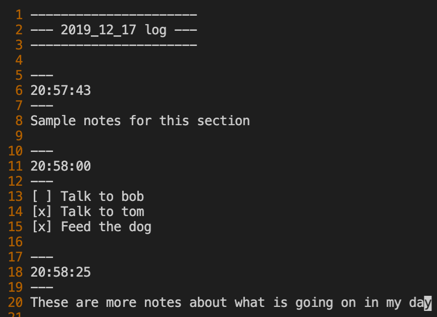

# bnote
Used to keep a daily running log using vim. Notes are stored in `~/.bnote/YYYY_MM_DD`.

## Install
Clone this directory and run the following commands.

`cp bnote /usr/local/bin`      
`chmod +x /usr/local/bin/bnote`

## Usage
### New Note / Editing
Simply run `bnote` to open your note, with a new timestamp, in vim.

### Viewing Old Notes
Run `bnote YYYY_MM_DD` to view the notes for that day

## Screenshot
